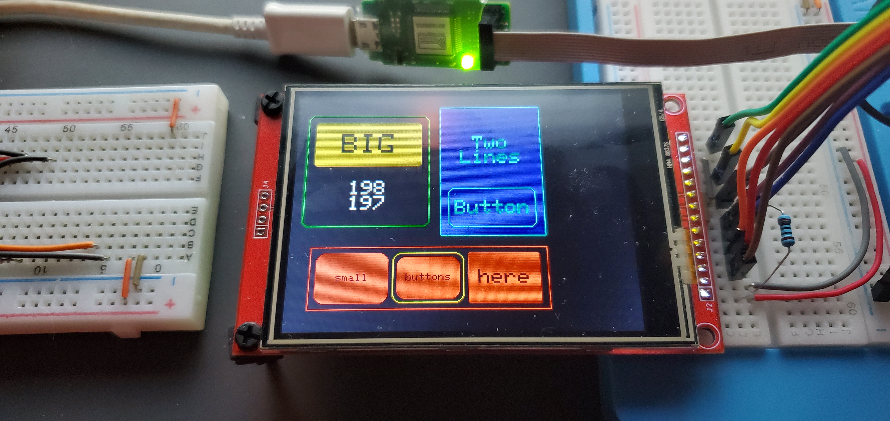
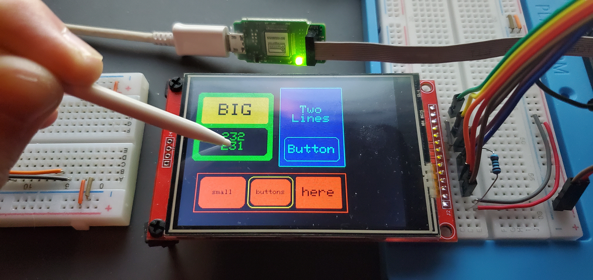
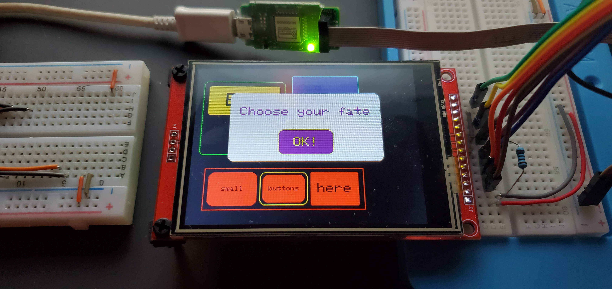

# ILI9341-Layout-Manager
##### An autolayout engine with callback support for designing and organizing buttons, text fields, and modal windows for ILI9341 chipsets

---

###### Features include:
- [x] Works with both Adafruit_ILI9341 and ILI9341_t3 (with minor modifications)
- [x] Uses my fork [XPT2046_Calibrated](https://github.com/ardnew/XPT2046_Calibrated) for touchscreen interface
   - Provides touchscreen calibration, so you get touch coordinates translated to screen coordinates automatically
   - Refer to [the example sketch in that library](https://github.com/ardnew/XPT2046_Calibrated/blob/master/examples/TouchCalibration/TouchCalibration.ino) for a quick-and-easy guide to calibrating your touchscreen (if needed)
- [x] Efficient screen updates, only redrawing regions of screen that changed
- [x] Rigorously controlled and predictable draw cycles
- [x] Dynamic layering architecture; for, e.g., modal popovers
- [x] Real-time updates to field content
- [x] Supports automatic layout of panel content in both horizontal and vertical directions
- [x] Subclass-friendly object-oriented architecture designed for extensibility
- [x] Supports user-defined callbacks for handling touch events on all components (including the screen itself)
- [x] Allows providing custom font for all fields (Adafruit_GFX GFXfont)
- [x] Momentary or persistent field selections, single and multiple-selection support
- [ ] Fully documented source code
   - Although it is well-formatted and implemented with consistent design throughout, documentation remains an incomplete task.

---

[An example sketch](examples/ilm-demo/ilm-demo.ino) is provided that demonstrates some of the features mentioned above. Please refer to it for general usage. 

The following are screenshots of the example sketch running on an Adafruit Grand Central M4. 

---

The code has been tested on an Adafruit Grand Central M4, an Adafruit ItsyBitsy M4, and a Teensy 4.0. 

Apart from the Teensy needing (wanting) to replace the TFT library from Adafruit_ILI9341 to ILI9341_t3, there was also a small change needed for the T4 linker script not to fail. I can add that to the example sketch if anyone is interested.
